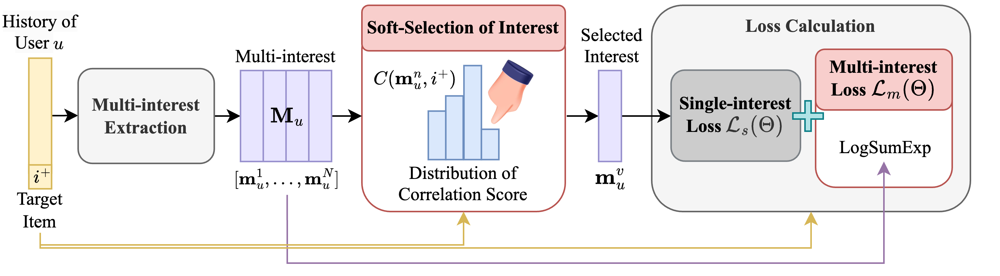

# Towards True Multi-interest Recommendation: Enhanced Scheme for Balanced Interest Learning


This project is a pytorch implementation of 'Towards True Multi-interest Recommendation: Enhanced Scheme for Balanced Interest Learning'.
BaM (<U/>Ba</U>lanced Interest Learning for <U/>M</U>ulti-interest Recommendation) is an effective and generally applicable training scheme for balanced learning of multi-interest and it achieves up to 31.43%% higher accuracy in sequential recommendation compared to the best competitor, resulting in the state-of-the-art performance.
This project provides executable source code with adjustable arguments and preprocessed datasets used in the paper.

## Prerequisites

- Python 3.8+
- [PyTorch](https://pytorch.org/)
- [NumPy](https://numpy.org/)
- [tqdm](https://tqdm.github.io/)

## Usage

There are 3 folders and each consists of:
- data: preprocessed datasets
- runs: pre-trained models for each dataset
- src: source codes

You can run a demo script 'demo.sh' to compare the performance of BaM_p (BaM with correlation score using simple inner-product (Equation (8) in the paper) and BaM_l (BaM with correlation score using additional linear layers (Equation (9) in the paper) on all datasets by evaluating pre-trained model.
The result looks as follows:
```
users: 22747
items: 17848
interactions: 841607
model loaded from ./runs/movies/BaM_p_T1/
test: 22747it [00:15, 1478.36it/s]
--------TEST[@10,@20]--------
recall: [0.0861, 0.1192]
nDCG:   [0.0504, 0.0587]

users: 22747
items: 17848
interactions: 841607
model loaded from ./runs/movies/BaM_l_T1/
test: 22747it [00:56, 404.60it/s]
--------TEST[@10,@20]--------
recall: [0.0794, 0.1134]
nDCG:   [0.0457, 0.0543]

.
.
.

```

You can also train the model by running 'main.py'.
There are 8 arguments you can control:
- path (any string, default is 'run1'): the path to save the trained model and training log.
- dataset ('movies', 'books', or 'electronics')
- model ('mind', 'comirec', or 'remi): the backbone model to use.
    * 'mind': MIND from "Chao Li, Zhiyuan Liu, Mengmeng Wu, Yuchi Xu, Huan Zhao, Pipei Huang, Guoliang Kang, Qiwei Chen, Wei Li, and Dik Lun Lee. 2019. Multi-Interest Network with Dynamic Routing for Recommendation at Tmall. In Proceedings of the 28th ACM International Conference on Information and Knowledge Management (CIKM '19). Association for Computing Machinery, New York, NY, USA, 2615–2623. https://doi.org/10.1145/3357384.3357814".
    * 'comirec': ComiRec-SA from "Yukuo Cen, Jianwei Zhang, Xu Zou, Chang Zhou, Hongxia Yang, and Jie Tang. 2020. Controllable Multi-Interest Framework for Recommendation. In Proceedings of the 26th ACM SIGKDD International Conference on Knowledge Discovery & Data Mining (KDD '20). Association for Computing Machinery, New York, NY, USA, 2942–2951. https://doi.org/10.1145/3394486.3403344".
    * 'remi': REMI from "Yueqi Xie, Jingqi Gao, Peilin Zhou, Qichen Ye, Yining Hua, Jae Boum Kim, Fangzhao Wu, and Sunghun Kim. 2023. Rethinking Multi-Interest Learning for Candidate Matching in Recommender Systems. In Proceedings of the 17th ACM Conference on Recommender Systems (RecSys '23). Association for Computing Machinery, New York, NY, USA, 283–293. https://doi.org/10.1145/3604915.3608766"
- random_seed (any int, default is 2021)
- selection ('hard', 'p' or 'l): the method of selecting interest from multi-interests.
    * 'hard': hard selection from previous methods.
    * 'p': The proposed soft-selection method BaM_p which uses a simple inner-product function for correlation score (Equation (8)).
    * 'l': The proposed soft-selection method BaM_l which uses additional linear layers for correlation score (Equation (9)).
- T (any number, default is 1): the softness of selection (tau in Equation (7)). Smaller the tau, softer the selection.
- linear_size (any number smaller than hidden_size, default is 16): the output size of linear layer in BaM_l (d' in Equation (9))
- multi_loss (True or False): to use the proposed multi-interest loss (Equation (12))

For example, you can train the model for Books dataset with BaM_p and tau of 1 on REMI at 'example' by following code:
```
python src/main.py --path example --dataset books --model remi --selection p --T 1 --multi_loss True
```

You can evaluate the trained_model by running 'main.py' with the argument 'test' as True:
```
python src/main.py --path example --dataset books --model remi --selection p --T 1 --multi_loss True --test True
```

## Datasets
Preprocessed data are included in the data directory.
| Dataset | Users | Items | Interactions | Density |
| --- | ---: | ---: | ---: | ---: |
|Movies & TV (movies)| 22,747 | 17,848 | 841,607 | 0.20% |
|Books (books) | 14,905 | 13,642 | 626,702 | 0.31% |
|Electronics (electronics) | 64,142 | 31,142 | 1,475,538 | 0.07% |
|MovieLens 1M (ml1m) | 6,040 | 3,706 | 1,000,209 | 4.47% |
|Yelp (yelp) | 12,283 | 122,345 | 1,385,636 | 0.09% |


The original datasets are available at:
- Amazon (Movies & TV, Books, and Electronics): https://mengtingwan.github.io/data/goodreads.html
- MovieLens 1M: https://grouplens.org/datasets/movielens/1m/
- Yelp: https://www.yelp.com/dataset
